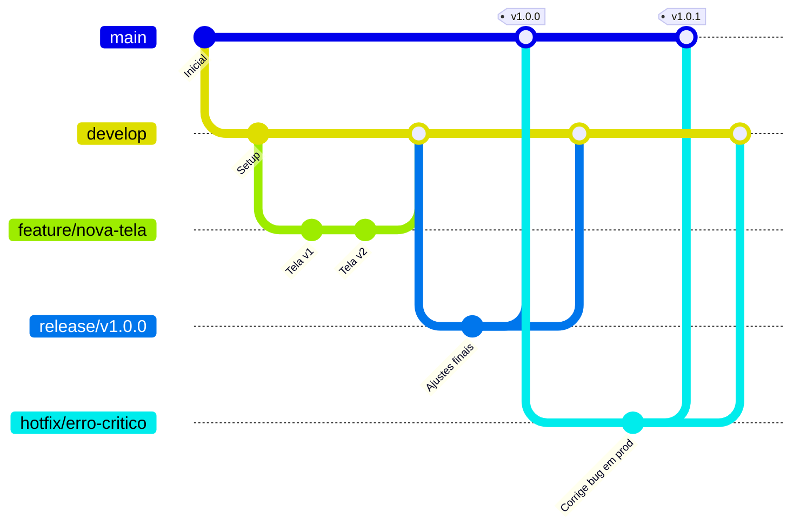
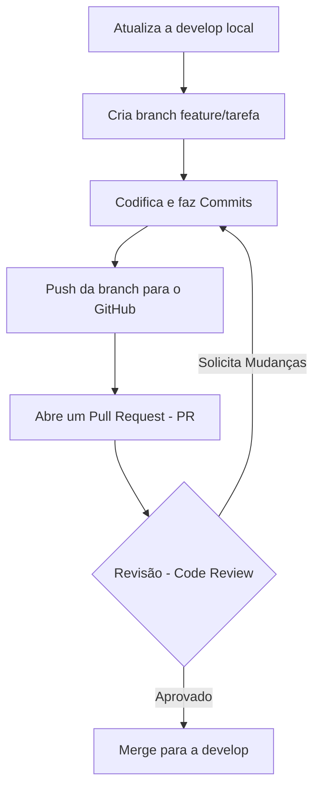

# O Básico de Git, GitHub e Gitflow

Este guia apresenta os conceitos essenciais do Git e GitHub, detalhando o fluxo de trabalho Gitflow, convenções de nomenclatura para branches e o padrão para mensagens de commit.

---

## 1. Comandos Básicos do Git

Aqui estão os comandos mais comuns para o dia a dia:

### Configuração Inicial
```bash
# Configurar nome de usuário e email
git config --global user.name "Seu Nome"
git config --global user.email "seu.email@exemplo.com"
```

### Inicialização e Clonagem
```bash
# Iniciar um novo repositório local
git init

# Clonar um repositório existente do GitHub
git clone https://github.com/usuario/repositorio.git
```

### Trabalhando com Alterações
```bash
# Verificar o status dos arquivos modificados
git status

# Adicionar arquivos específicos para a área de preparação (staging)
git add nome-do-arquivo.ext

# Adicionar todos os arquivos modificados de uma vez
git add .

# Criar um commit com as alterações (preferência por mensagens curtas e de linha única)
git commit -m "feat: adiciona nova funcionalidade de login"

# Ver o histórico de commits
git log --oneline
```

### Sincronizando com o GitHub (Remoto)
```bash
# Enviar commits locais para o repositório remoto (GitHub)
git push origin nome-da-branch

# Baixar e integrar as atualizações do repositório remoto para o local
git pull origin nome-da-branch
```

---

## 2. Gitflow: O Fluxo de Trabalho

O **Gitflow** é um modelo de ramificação (branching) estruturado que define um controle rigoroso em torno do lançamento do projeto. Ele atribui papéis muito específicos a diferentes branches e define como e quando elas devem interagir.

### Branches Principais (Eternas)

Estas branches sempre existem no repositório:

- **`main`** (ou `master`): Contém o código de produção. Sempre deve estar em um estado funcional e estável. Todo código aqui já foi testado e aprovado.
- **`develop`**: A branch de integração. Todas as novas funcionalidades (features) são mescladas (merged) aqui. É o "próximo release" em construção.

### Diagrama do Fluxo (Gitflow)



---

## 3. Padrões de Nomenclatura de Branches

Para organizar o desenvolvimento, usamos branches temporárias que são criadas a partir da `develop` (ou `main` em casos urgentes) e depois mescladas de volta.

### Tipos de Branches de Desenvolvimento

- **`feature/`** ou **`feat/`**:
  - **Para que serve:** Desenvolver novas funcionalidades.
  - **Origem:** `develop`
  - **Destino:** `develop`
  - **Exemplo:** `feature/nova-tela-de-perfil`, `feature/login-com-google`

- **`bugfix/`** ou **`fix/`**:
  - **Para que serve:** Corrigir bugs não críticos encontrados no ambiente de desenvolvimento (`develop`).
  - **Origem:** `develop`
  - **Destino:** `develop`
  - **Exemplo:** `fix/erro-calculo-carrinho`

- **`hotfix/`**:
  - **Para que serve:** Correções emergenciais diretamente em produção. É a única branch de suporte que deve nascer da `main`.
  - **Origem:** `main`
  - **Destino:** `main` e `develop` (para garantir que a correção não se perca)
  - **Exemplo:** `hotfix/crash-na-tela-inicial`

- **`release/`**:
  - **Para que serve:** Preparação para um novo lançamento em produção. Usada para pequenos ajustes finais, correção de bugs de última hora e preparação de metadados (como versão).
  - **Origem:** `develop`
  - **Destino:** `main` e `develop`
  - **Exemplo:** `release/v1.2.0`

---

## 4. Convenção de Commits (Conventional Commits)

Seguimos o padrão do *Conventional Commits* para facilitar a leitura do histórico e a geração automática de changelogs. 

> **Nota sobre o Estilo:** Mantenha as mensagens de commit curtas, diretas e, de preferência, em uma única linha.

### Estrutura
`<tipo>: <descrição curta>`

### Tipos de Commits Permitidos

- **`feat`**: Adição de uma nova funcionalidade (feature).
  - *Ex: `feat: cria endpoint para listagem de usuários`*
- **`fix`**: Correção de um bug (bugfix/hotfix).
  - *Ex: `fix: resolve erro de null pointer no calculo de juros`*
- **`perf`**: Mudança de código que melhora a performance, sem alterar o comportamento externo.
  - *Ex: `perf: otimiza query de busca no banco de dados`*
- **`refactor`**: Refatoração de código (não adiciona feature nem corrige bug, apenas melhora a estrutura interna).
  - *Ex: `refactor: extrai logica de validacao para classe separada`*
- **`docs`**: Alterações apenas na documentação (README, swagger, etc).
  - *Ex: `docs: atualiza readme com instrucoes de setup local`*
- **`style`**: Mudanças de formatação ou estilo (espaços em branco, formatação, falta de ponto e vírgula, etc) que não afetam o significado do código.
  - *Ex: `style: formata arquivos com prettier`*
- **`test`**: Adição de testes ausentes ou correção de testes existentes.
  - *Ex: `test: adiciona cobertura para o servico de pagamento`*
- **`chore`**: Atualizações de tarefas de build, configurações de pacotes, dependências ou ferramentas auxiliares que não modificam o código fonte de produção.
  - *Ex: `chore: atualiza versao do react para 18`*
- **`ci`**: Mudanças nos arquivos e scripts de configuração de Integração Contínua (CI) (ex: GitHub Actions, Travis, etc).
  - *Ex: `ci: adiciona pipeline de deploy para staging`*

---

## 5. Dinâmica de Acesso ao Repositório

Para a disciplina, os repositórios oficiais seguirão um modelo centralizado para simular o controle de qualidade corporativo:

* **Professor (Admin):** É o dono/administrador do repositório. Ele configura regras de proteção (impedindo push direto na `main` e `develop`), monitora as métricas de contribuição individual e pode aprovar/reprovar *Pull Requests*.
* **Alunos (Collaborators):** Vocês serão convidados para o repositório como colaboradores com permissão de escrita (*Write*). Isso permite clonar, criar branches (`feature/`, `bugfix/`) e enviar (*push*) essas branches para o GitHub. **Vocês não podem commitar diretamente nas branches protegidas**.

---

## 6. O Ciclo de Vida de uma Entrega (Pull Request)

Todo código novo deve passar por um processo de revisão. O fluxo prático para entregar uma tarefa é o seguinte:



### Boas Práticas para Descrição de Pull Requests (PRs)

O PR é onde você "vende" o seu código para o revisor (seus colegas de equipe ou o professor). Uma descrição vazia ou muito vaga atrasa a aprovação e dificulta o entendimento do que foi feito.

#### Exemplo de PR Ruim
**Título:** `Ajustes`
**Descrição:** `Fiz a tela de login.`
*(Por que é ruim? Não explica o que foi feito, como testar e nem se há alguma pendência ou dependência).*

#### Exemplo de PR Excelente
**Título:** `feat: implementa rota e validacao de login`
**Descrição:**
```markdown
## O que foi feito?
- Criada a rota `/api/v1/login` utilizando FastAPI.
- Adicionada validação de hash da senha no banco PostgreSQL.
- Retorno do token JWT em caso de sucesso.
- Tratamento de erro (HTTP 401) para credenciais inválidas.

## Como testar?
1. Rode as migrações do banco: `alembic upgrade head`
2. Suba o servidor com `uvicorn main:app --reload`
3. Envie um POST para `/api/v1/login` usando o Postman ou Swagger.

## Observações
- A lógica de expiração do token está mockada para 24h, ajustaremos na próxima sprint.
```

---

## 7. Integração de Código: Merge vs Rebase e Resolução de Conflitos

Quando você trabalha em equipe, é comum que a branch `develop` receba novos commits enquanto você ainda está trabalhando na sua branch `feature`. Para manter sua branch atualizada, você precisará integrar essas mudanças.

### Merge vs Rebase

Existem duas formas principais de trazer as atualizações da `develop` para a sua branch atual:

* **`git merge develop`**: Pega todas as mudanças da `develop` e cria um *novo commit de merge* na sua branch. 
  * *Pró:* Preserva o histórico exato de como as coisas aconteceram (não reescreve o passado).
  * *Contra:* O histórico pode ficar poluído com muitos commits de "Merge branch develop into feature...".
* **`git rebase develop`**: "Desconecta" os seus commits temporariamente, puxa as atualizações da `develop` e então aplica os seus commits *no topo* do histórico atualizado.
  * *Pró:* Mantém o histórico linear e limpo.
  * *Contra:* Você está reescrevendo o histórico da sua branch. (Regra de ouro: **Nunca faça rebase em branches públicas como main ou develop**, apenas na sua branch local de feature).

Para a disciplina, recomendamos o uso de `git merge` local ou a interface do GitHub para resolver integrações no PR.

### Como Resolver Conflitos de Merge

Conflitos ocorrem quando duas pessoas alteram **a mesma linha do mesmo arquivo**. O Git não sabe qual versão manter e pede sua ajuda.

**Cenário:** Você tentou fazer um `git merge develop` na sua branch e o terminal mostrou:
`CONFLICT (content): Merge conflict in main.py`

**Passo a Passo para Resolver:**

1. **Abra o arquivo conflitante (ex: `main.py`) no seu editor (VS Code).**
   O editor destacará as áreas de conflito com marcadores do Git:
   ```python
   <<<<<<< HEAD (Current Change - A sua alteração)
   print("Olá, Turma A!")
   =======
   print("Olá, Mundo!")
   >>>>>>> develop (Incoming Change - O que veio da develop)
   ```
2. **Escolha a versão correta:** Apague os marcadores (`<<<<<<<`, `=======`, `>>>>>>>`) e deixe o código exatamente como ele deve ficar na versão final (pode ser a sua, a do colega, ou uma mistura das duas). No VS Code, você pode usar os botões *Accept Current Change*, *Accept Incoming Change* ou *Accept Both Changes*.
3. **Marque como resolvido:** Volte ao terminal e adicione o arquivo corrigido:
   ```bash
   git add main.py
   ```
4. **Finalize o Merge:**
   ```bash
   git commit -m "Merge: resolve conflitos com develop em main.py"
   ```
   *(Se você estava fazendo um rebase, o comando seria `git rebase --continue`).*

---

## 8. Resumo do Fluxo Diário

1. **Sincronize:** Atualize sua `develop` local: `git checkout develop` -> `git pull origin develop`
2. **Isole:** Crie sua branch a partir dela: `git checkout -b feature/minha-nova-tarefa`
3. **Desenvolva:** Codifique e faça commits seguindo o padrão: `git add .` -> `git commit -m "feat: implementa logica inicial"`
4. **Publique a branch:** Envie sua branch para o repositório remoto: `git push origin feature/minha-nova-tarefa`
5. **Entregue para Revisão:** Vá ao GitHub e abra um **Pull Request (PR)** da sua branch para a `develop`, preenchendo uma descrição clara.
