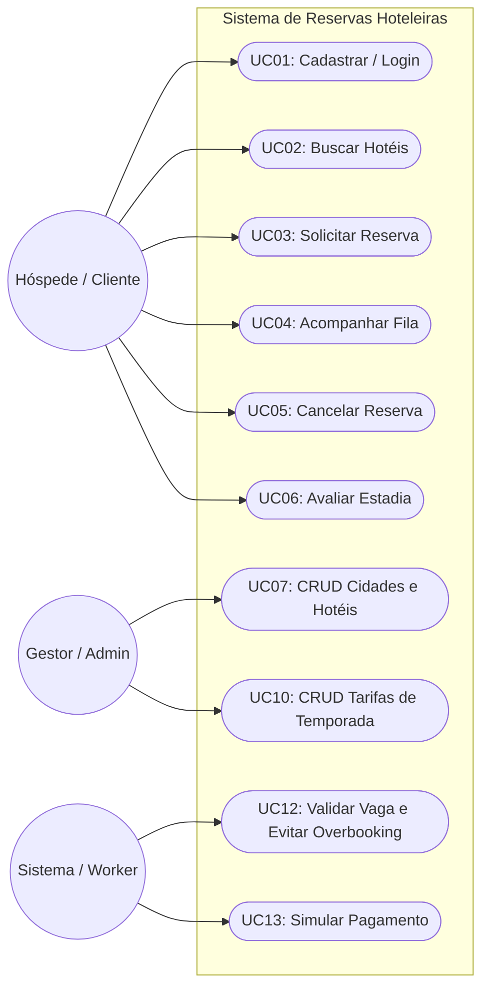

# Requisitos Mínimos e Casos de Uso Obrigatórios (Escopo Mínimo)

Este documento define o **escopo mínimo aceitável** para a entrega do projeto prático pelas equipes da disciplina de **Estágio II**. Ele detalha os Casos de Uso, Requisitos Funcionais (RFO) e Não Funcionais (RNFO) obrigatórios, servindo como o contrato pedagógico de avaliação do semestre.

---

## 1. Escopo de Telas Obrigatórias (Front-End)

O front-end do sistema deve conter, de forma obrigatória, o seguinte fluxo de interfaces funcionais:

1. **Tela de Autenticação (Login e Cadastro):**
   * Formulário de login para e-mail e senha.
   * Formulário de cadastro para novos clientes.
2. **Tela de Busca de Hotéis (Home):**
   * Filtro de busca contendo: seletor de Cidades (dropdown), seletor de período (Check-in/Check-out) e quantidade de hóspedes (separando adultos e crianças).
   * Exibição dos hotéis correspondentes cadastrados na cidade buscada.
3. **Tela de Detalhes do Hotel & Quartos:**
   * Apresentação das comodidades gerais do hotel e média de avaliações.
   * Listagem de quartos disponíveis exibindo: número do quarto, tipo (Simples/Casal/Família), capacidade limite de adultos/crianças, preço base e botão de ação para iniciar a reserva.
4. **Tela de Checkout & Customização:**
   * Resumo de diárias do quarto.
   * Seletores para opções de **Early Check-in** e **Late Checkout**.
   * Escolha de **Tipo de Tarifa** (Reembolsável ou Não Reembolsável).
   * Seletor de serviços adicionais opcionais (ex: Café da Manhã).
   * Exibição do valor total dinâmico recalculado antes da confirmação.
5. **Tela de Processamento de Reserva (Feedback de Fila):**
   * Interface de carregamento (loading) que inicia um ciclo de polling enquanto o status da reserva for `Pendente`.
   * Feedback visual imediato de sucesso (Voucher gerado) ou de erro (quarto indisponível ou falha no pagamento fictício).
6. **Painel do Hóspede (Minhas Reservas):**
   * Listagem de reservas solicitadas pelo cliente conectado com indicação clara do status (`Pendente`/`Confirmada`/`Cancelada`).
   * Exibição da data limite para cancelamento gratuito (se aplicável) e botão "Cancelar Reserva".
   * Acesso ao formulário de Avaliação (nota e comentário) para reservas com estadias concluídas.
7. **Painel do Administrador (Gestor):**
   * Dashboard ou menu administrativo para listagem e criação (CRUDs) das entidades base: **Cidades**, **Hotéis**, **Quartos** e **Tarifas de Temporada**.

---

## 2. Requisitos Funcionais Obrigatórios (RFO)

O sistema do projeto prático (API do back-end + front-end) deve atender obrigatoriamente às seguintes lógicas:

### A. Autenticação e Perfis
* **RFO01 - Controle de Acesso (Auth JWT):** Exigir token JWT para rotas privadas (criação de reservas, consultas a reservas pessoais e postagem de avaliações).
* **RFO02 - Restrição Administrativa (RBAC):** Impedir que clientes acessem rotas de administração de dados. Apenas usuários com `is_admin=True` podem acessar endpoints de cadastro de cidades, hotéis, quartos e tarifas.
* **RFO03 - Hashing de Senhas:** As senhas nunca devem trafegar em texto plano ou ser salvas abertas. Devem sofrer hash criptográfico (bcrypt ou pbkdf2) antes do salvamento no PostgreSQL.

### B. Busca e Catálogo (CQRS)
* **RFO04 - Pesquisa de Catálogo Otimizada (MongoDB):** A busca principal de hotéis e quartos exibida na home deve consumir diretamente os documentos desnormalizados da coleção `catalogo_hoteis` no MongoDB.

### C. Reserva e Processamento (Mensageria)
* **RFO06 - Solicitação de Reserva Assíncrona:** O FastAPI deve salvar a reserva no Postgres com status `Pendente`, publicar na fila `solicitacoes-reserva` do RabbitMQ e responder ao cliente imediatamente com código `202 Accepted` para liberar a interface.
* **RFO07 - Lógica de Preços por Hóspede:**
  * Bebês (0 a 5 anos): Hospedagem grátis (com opção de solicitar berço).
  * Crianças (6 a 12 anos): Taxa correspondente a 50% do valor de um hóspede extra adulto.
* **RFO08 - Precificação Dinâmica (Temporadas):** Aplicar o multiplicador da `TarifaTemporada` (alta estação) nas diárias cujas datas coincidam com o período cadastrado.
* **RFO09 - Taxa de Entrada/Saída Flexível:** Adicionar acréscimo de 30% da diária por cada opcional selecionado: Early Check-in (entrada a partir de 08h) e/ou Late Checkout (saída até 18h).
* **RFO10 - Políticas de Cancelamento:**
  * Tarifa Reembolsável: Cancelamento grátis até 48 horas antes do check-in. Cancelamento tardio ou No-Show desconta multa de 1 diária do quarto.
  * Tarifa Não Reembolsável: Desconto de 10% na reserva. Retém 100% do valor em caso de cancelamento.
* **RFO11 - Trilha de Auditoria Imutável (MongoDB):** Gravar na coleção `historico_auditoria` do MongoDB cada mudança de status da reserva (`SOLICITADA`, `EM_FILA`, `APROVADA`, `CANCELADA`), incluindo detalhes operacionais.

### D. Avaliações e Cadastro
* **RFO12 - Restrição de Avaliações:** Apenas permitir que um cliente avalie um hotel se ele de fato possuir uma reserva `Confirmada` naquele hotel e se o check-out já tiver ocorrido.

---

## 2.1. Requisitos Opcionais (Bônus)

Não fazem parte do entregável mínimo. Equipes que concluírem o caminho crítico podem implementá-los para pontuação adicional, conforme o [roadmap de sprints](../01_planejamento_metodologia/roadmap_sprints.md).

* **RFO05 - Busca por Limites Territoriais:** A API do FastAPI deve permitir filtrar hotéis cujas coordenadas (`localizacao` em JSONB/GeoJSON, na tabela `hoteis`) estejam dentro do polígono geográfico (`limite_territorial`) da cidade selecionada.

---

## 3. Requisitos Não Funcionais Obrigatórios (RNFO)

Os critérios técnicos e de qualidade obrigatórios do projeto são:

* **RNFO01 - Polyglot Persistence:**
  * PostgreSQL para dados transacionais estruturados.
  * MongoDB para catálogo de busca otimizado e histórico/auditoria de transações.
* **RNFO02 - Baixa Latência de Resposta:** O tempo de resposta HTTP do endpoint de criação de reserva (FastAPI) não deve ultrapassar 200ms sob carga normal, delegando processamento pesado à fila.
* **RNFO03 - Prevenção de Overbooking (Consumo Serial):** O worker do RabbitMQ deve processar mensagens sequencialmente por quarto para garantir que dois usuários não aluguem simultaneamente o mesmo quarto na mesma data.
* **RNFO04 - Arquitetura de Camadas:** Organizar o backend estritamente separando as camadas (API/Routes, Schemas DTO, Services de Lógica e Models ORM).
* **RNFO05 - Responsividade (UI Mobile-First):** A interface do front-end deve ser responsiva, adaptando-se de forma fluida a dispositivos móveis e desktops.
* **RNFO06 - Tratamento de Erros e Resiliência:** Em caso de queda do RabbitMQ ou do banco, a API do FastAPI não deve crashar; deve responder com erros HTTP formatados e amigáveis (ex: 503 Service Unavailable).
* **RNFO07 - Testes de Regra de Negócio (Pytest):** Cobertura mínima de 70% de testes unitários para a camada de `Services` (cálculo de tarifas, validação de capacidade e cancelamento).

---

## 4. Casos de Uso do Sistema (Atores e Ações)

Para facilitar o mapeamento de testes e desenvolvimento das equipes, os Casos de Uso mínimos do sistema estão representados no diagrama abaixo e detalhados a seguir:

### 4.1. Casos de Uso do Hóspede (Cliente)
* **UC01 - Cadastrar Conta e Login:** Criar perfil pessoal, validar dados e obter token de autenticação JWT.
* **UC02 - Buscar Hotéis e Quartos:** Filtrar por destino, período de check-in/out e capacidade total, consultando a visualização rápida do MongoDB.
* **UC03 - Solicitar Reserva:** Preencher dados de hóspedes, selecionar comodidades (early check-in, late checkout, berço), tipo de tarifa (reembolsável vs não-reembolsável) e fechar pedido.
* **UC04 - Acompanhar Processamento da Fila:** Visualizar status de carregamento na tela enquanto o front-end consulta o status da reserva via polling.
* **UC05 - Cancelar Reserva:** Cancelar a estadia pelo painel do hóspede, sofrendo incidência de multa de acordo com o prazo de 48h e tipo de tarifa.
* **UC06 - Avaliar Estadia:** Deixar nota e comentário após concluir a viagem.

### 4.2. Casos de Uso do Gestor (Administrador)
* **UC07 - Gerenciar Cidades (CRUD):** Cadastrar novos municípios informando os polígonos limites geográficos (GeoJSON).
* **UC08 - Gerenciar Hotéis (CRUD):** Cadastrar hotéis associados a cidades, definindo número de estrelas e comodidades.
* **UC09 - Gerenciar Quartos (CRUD):** Cadastrar quartos por hotel com capacidade máxima de adultos e crianças, além do preço de diária padrão.
* **UC10 - Gerenciar Tarifas de Temporada (CRUD):** Criar períodos de alta estação com multiplicadores percentuais associados à franquia ou hotel específico.
* **UC11 - Monitorar Trilha de Auditoria:** Visualizar logs operacionais gerados em segundo plano a partir do MongoDB.

### 4.3. Casos de Uso do Sistema (Workers Assíncronos)
* **UC12 - Validar Vaga e Evitar Overbooking:** Consumir a reserva da fila e verificar se o período de check-in/out está livre no PostgreSQL.
* **UC13 - Processar Cobrança:** Efetuar a chamada de simulação de pagamento.
* **UC14 - Atualizar Reserva e Logar Histórico:** Atualizar o status final da reserva no Postgres e gravar o respectivo log na coleção de auditoria no MongoDB.
