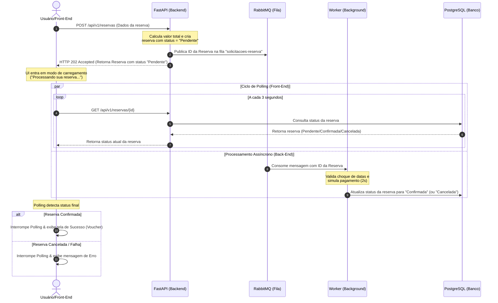
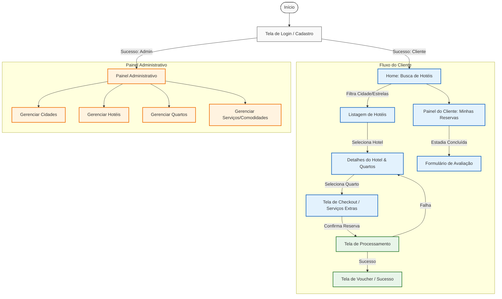

# Arquitetura e Diretrizes do Front-End

Este documento define as diretrizes arquiteturais, o fluxo de telas, a estratégia de integração com a API assíncrona e os padrões de interface (UI/UX) para o desenvolvimento do client do **Sistema de Reservas de Rede Hoteleira**.

---

## 1. Fluxo de Integração Assíncrona e Fila (Mermaid)

Como o processamento de reservas ocorre em segundo plano no back-end (via FastAPI e RabbitMQ), o front-end deve gerenciar o estado da transação de forma assíncrona. Abaixo está o fluxo detalhado da comunicação utilizando a estratégia de **Short Polling** (Consulta Periódica):



---

## 2. Mapa de Navegação e Fluxo de Telas (Mermaid)

O front-end é dividido em duas áreas principais: a **Área Pública/Cliente** e o **Painel Administrativo** (exclusivo para gestores).



---

## 3. Requisitos por Tela

### 3.1. Tela de Login e Cadastro
* **Formulários:** Login (E-mail e Senha) e Cadastro de Usuário (Nome, E-mail, Senha e Confirmação de Senha).
* **Segurança:** O JWT retornado pelo back-end deve ser interceptado e salvo localmente para autenticar as próximas requisições.
* **Validação:** Feedback instantâneo para senhas fracas, e-mails inválidos ou credenciais incorretas (HTTP 401).

### 3.2. Home e Busca de Hotéis
* **Filtros de Busca:**
  * Seleção de **Cidade** (Dropdown/Select carregado dinamicamente da API).
  * Seleção de **Data de Check-in e Check-out** (DatePicker).
  * Seleção de **Quantidade de Hóspedes** (separado em: Adultos e Crianças com idades para cálculo de isenções/descontos).
  * Filtro por **Categoria de Estrelas** (1 a 5 estrelas).
* **UX:** Exibir uma interface convidativa, com imagens ilustrativas de hotéis (geradas ou estáticas) e carregamentos suaves (*skeletons*).

### 3.3. Detalhes do Hotel e Quartos
* **Exposição do Hotel:** Exibe o nome do hotel, estrelas, comodidades associadas (ex: Piscina, Wi-Fi, Academia) e a média das avaliações dos clientes.
* **Listagem de Quartos:** Mostra os quartos disponíveis naquele hotel específico, incluindo:
  * Número e Tipo (ex: Simples, Casal, Triplo, Família).
  * Preço Base da Diária.
  * Capacidade limite detalhada (Ex: "Até 2 adultos e 2 crianças").
  * Botão de "Reservar".

### 3.4. Checkout e Opções Personalizadas
* **Resumo:** Mostra o quarto selecionado e o cálculo do período de diárias.
* **Tarifa Dinâmica (Exibição):** Se o período coincidir com datas de alta estação cadastrada no backend, a interface deve exibir de forma clara o multiplicador aplicado (Ex: "Diária base: R$ 200,00 | Período de Alta Estação (+30%): R$ 260,00").
* **Escolha de Tarifa (Política de Cancelamento):**
  * `Reembolsável` (Preço normal, cancelamento grátis até 48h antes do check-in).
  * `Não Reembolsável` (Aplica 10% de desconto no total, sem possibilidade de devolução).
* **Adicionais de Estadia:**
  * Opção de **Early Check-in** (+30% do valor de 1 diária).
  * Opção de **Late Checkout** (+30% do valor de 1 diária).
  * Opção de **Berço** (adiciona 1 berço grátis ou com taxa fixa caso existam bebês de 0 a 5 anos).
* **Serviços Opcionais:** Catálogo geral com checkboxes (ex: Café da manhã premium, Translado).
* **Cálculo Dinâmico (Front-End):** O front-end calcula em tempo real o preço estimado para o cliente (incluindo descontos por crianças menores de 6 anos e meia-tarifa para crianças de 6 a 12 anos em hóspedes extras).

### 3.5. Painel do Cliente (Minhas Reservas)
* **Histórico:** Lista todas as reservas que o usuário logado realizou.
* **Status Visual (Badge):**
  * `Pendente` (Amarelo/Alerta)
  * `Confirmada` (Verde/Sucesso)
  * `Cancelada` (Vermelho/Erro)
* **Informações de Cancelamento:** Exibe a `data_limite_cancelamento` para reservas Reembolsáveis e um botão "Cancelar Reserva". Caso cancelado após o prazo, avisa sobre a multa aplicada (equivalente a 1 diária ou 100% se não reembolsável).
* **Avaliação:** Reservas concluídas (`Confirmada` e com data de check-out no passado) devem exibir um botão "Avaliar Hotel", abrindo um formulário para nota (1 a 5) e comentário.

### 3.6. Painel Administrativo (Gerencial)
* **CRUDs Completos:** Interfaces administrativas com tabelas e formulários para cadastrar, editar e remover:
  * **Cidades:** Cadastro de nome, estado e limites territoriais.
  * **Hotéis:** Associação com Cidades e definição de categoria de estrelas.
  * **Tarifas de Temporada:** Cadastro de datas de início/fim e o multiplicador de tarifas.
  * **Quartos:** Associação com Hotéis, número, tipo, preços e limites de adultos/crianças.
  * **Comodidades e Serviços:** Cadastro do catálogo global.

---

## 4. Integração com a API e Segurança (JWT)

### 4.1. Armazenamento e Envio de Tokens
* O token JWT retornado no login deve ser enviado no cabeçalho HTTP de todas as requisições privadas:
  ```http
  Authorization: Bearer <seu_token_jwt_aqui>
  ```
* Se o token expirar, a API retornará `401 Unauthorized`. O front-end deve interceptar esse erro, limpar o token armazenado e redirecionar o usuário imediatamente para a tela de Login.

### 4.2. Rotas Protegidas (Guards)
* **Rota Pública:** `/` (Busca e visualização de hotéis/quartos).
* **Rotas de Clientes:** `/checkout`, `/minhas-reservas` (Requer token JWT padrão).
* **Rotas Administrativas:** `/admin/*` (Requer token JWT e validação de permissão de administrador `is_admin === true`).
