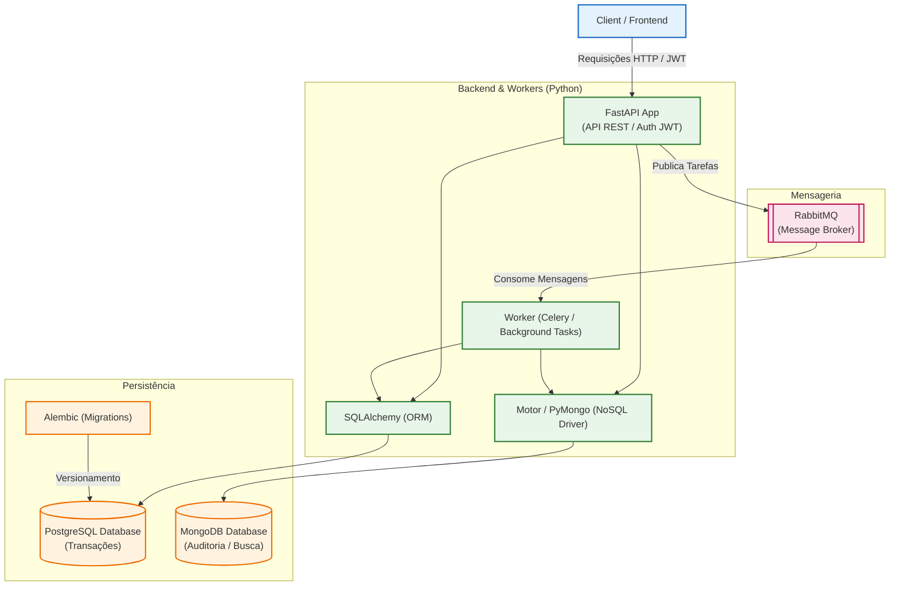

# Arquitetura e Projeto Prático: Estágio II (Backend)

Este documento detalha a arquitetura de referência, a stack tecnológica e o escopo do projeto prático que será desenvolvido ao longo da disciplina de **Estágio II em Desenvolvimento Web**.

---

## 1. Arquitetura de Referência e Stack Tecnológica

O projeto prático guiará os alunos no desenvolvimento de uma aplicação robusta, com arquitetura em camadas bem definidas e foco nas melhores práticas de desenvolvimento backend em Python, utilizando processamento assíncrono.

### Tecnologias Adotadas:
* **Framework Web:** **FastAPI** para criação rápida de APIs assíncronas de alto desempenho, documentação automática com Swagger e validação de tipos de dados.
* **Gerenciador de Dependências:** **Poetry** (ou **pip** tradicional via `requirements.txt`) para gerenciamento de dependências, empacotamento e isolamento de ambientes virtuais.
* **Banco de Dados Relacional:** **PostgreSQL** para persistência estruturada e controle transacional de dados altamente íntegros (Reservas, Contratos, Contas).
* **Ferramenta de Migração:** **Alembic** para versionamento e controle estruturado do esquema do banco de dados relacional.
* **Banco de Dados NoSQL:** **MongoDB** para persistência de trilhas de auditoria assíncronas e view models desnormalizadas para buscas ultrarrápidas de catálogo (padrão CQRS).
* **Autenticação e Segurança:** Autenticação baseada em **JWT (JSON Web Tokens)** para segurança de rotas e persistência de sessão stateless.
* **Mensageria e Background Tasks:** **RabbitMQ** atuando como message broker para o processamento assíncrono de tarefas de longa duração e comunicação desacoplada via filas (ex: integrado com Celery ou pika).
* **Containerização (Opcional/Recomendado):** Docker & Docker Compose para orquestração simplificada dos bancos PostgreSQL e MongoDB, RabbitMQ e ambiente de desenvolvimento.

### Divisão de Responsabilidades na Arquitetura:

---

## 2. Projeto Oficial da Disciplina: Sistema de Reservas de Rede Hoteleira (Franquia Multicidades)

O projeto selecionado para ser desenvolvido ao longo do semestre é o **Sistema de Reservas de Rede Hoteleira**, focado em gerenciar uma franquia de hotéis que atua em várias cidades do país, com categorias de 1 a 5 estrelas.

### Divisão de Responsabilidades e Stack:

#### 2.1. Autenticação (JWT)
* **Gestor da Franquia (Admin):** Usuário administrador responsável pela gerência da rede. Apenas ele pode acessar endpoints de cadastro de hotéis e cidades (`is_admin=True`).
* **Clientes:** Usuários finais que realizam login para buscar hotéis, visualizar suas próprias reservas e criar novas solicitações de hospedagem.

#### 2.2. Persistência e Migrações (PostgreSQL + Alembic)
* **Modelagem Relacional Completa (UUIDv7):**
  - `Usuario`: `id`, `nome`, `email`, `senha_hash`, `is_admin`.
  - `Cidade`: `id`, `nome`, `estado` (Ex: Quixadá, CE), `limite_territorial` (GeoJSON - limites geográficos em formato JSONB).
  - `Hotel`: `id`, `nome`, `cidade_id` (FK), `categoria_estrelas` (1 a 5 estrelas).
  - `Quarto`: `id`, `hotel_id` (FK), `numero`, `tipo` (Simples/Casal/Triplo/Família), `preco_diaria`, `max_adultos`, `max_criancas`.
  - `TarifaTemporada`: `id`, `nome`, `data_inicio`, `data_fim`, `multiplicador`, `hotel_id` (FK, NULL).
  - `Comodidade`: `id`, `nome`.
  - `HotelComodidade` (Associativa): `hotel_id` (FK), `comodidade_id` (FK).
  - `Reserva`: `id`, `usuario_id` (FK), `quarto_id` (FK), `data_checkin` (date), `data_checkout` (date), `quantidade_adultos`, `quantidade_criancas`, `early_checkin`, `late_checkout`, `necessita_berco`, `tarifa_tipo` (Reembolsavel/Nao_Reembolsavel), `data_limite_cancelamento`, `valor_total`, `status` (`Pendente`, `Confirmada`, `Cancelada`), `valor_multa_cancelamento`.
  - `Avaliacao`: `id`, `usuario_id` (FK), `hotel_id` (FK), `nota` (1 a 5), `comentario`, `data_publicacao`.
  - `ServicoAdicional`: `id`, `nome`, `preco`.
  - `ReservaServico` (Associativa): `reserva_id` (FK), `servico_id` (FK), `quantidade`, `preco_cobrado`.

#### 2.3. Backend e Lógica (FastAPI)
* **Rotas Públicas:** Busca de hotéis por **Cidade** e/ou **Estrelas (1 a 5)** e visualização de seus quartos com suas respectivas capacidades de adultos/crianças.
* **Rotas de Clientes:** Criação de reservas de quartos com contratação opcional de serviços adicionais, escolha de tipo de tarifa (reembolsável/não reembolsável) e opções de horários (early check-in/late checkout), além de postagem de avaliações após check-out.
* **Rotas de Admin:** Cadastro e gerenciamento de cidades, hotéis, quartos, tarifas de temporada, comodidades e serviços adicionais.

#### 2.4. Mensageria e Workers (RabbitMQ)
* **O Fluxo Assíncrono da Reserva:**
  1. O cliente solicita uma reserva de um quarto pelo FastAPI, enviando a quantidade de adultos/crianças e opções extras.
  2. O FastAPI calcula de forma preliminar o valor total (diárias bases com desconto/taxas extras aplicadas, adicionais de early check-in/late checkout + berço e serviços opcionais), salva a reserva no banco de dados com status `"Pendente"` e calcula a `data_limite_cancelamento` (se a tarifa for reembolsável). Em seguida, publica o ID da reserva na fila `solicitacoes-reserva` do RabbitMQ.
  3. O **Worker (Celery/pika)** consome a mensagem de forma assíncrona:
     - **Validação de Vagas:** Verifica se o quarto solicitado (`quarto_id`) já possui reserva confirmada para o período de check-in/check-out selecionado (evitando choque de agendas).
     - **Validação de Preços e Regras:** Recalcula as diárias aplicando os multiplicadores de `TarifaTemporada` ativos nos dias da estadia, confere se crianças adicionais (6 a 12 anos) foram cobradas a 50% da taxa de hóspede extra e se menores de 5 anos foram isentos.
     - **Simulação de Pagamento:** Simula o processamento do pagamento (aguarda 2 segundos com `time.sleep`).
     - **Finalização:** 
       - Se aprovado e sem choque de datas: altera o status da reserva para `"Confirmada"` e publica na fila `notificacoes-email` para simular o envio do voucher.
       - Se houver conflito de datas ou falha no pagamento: altera o status para `"Cancelada"`.

---

## 3. Próximos Passos (Planejamento das Sprints Técnicas)
* **Sprint 1 (Setup, Banco e Seeds):** Inicialização do projeto utilizando **Poetry** (ou **pip** tradicional) para gerenciar as dependências (FastAPI, SQLAlchemy, Alembic, etc.), configuração do Docker Compose para o PostgreSQL, definição dos primeiros modelos de dados (Usuário, Cidade, Hotel) e geração/execução das migrações de banco iniciais com o **Alembic**. Criação de um script de **seeds** para popular o banco com um usuário administrador padrão, algumas cidades (ex: Quixadá, Fortaleza) e hotéis de teste variando de 1 a 5 estrelas.
* **Sprint 2 (Autenticação JWT, Cidades e Hotéis):** Implementação do fluxo de login com criptografia de senhas e geração de tokens JWT. Desenvolvimento dos endpoints para cadastro e consulta de cidades e hotéis, criando novas migrações com o **Alembic** caso ocorram refinamentos nos modelos de dados.
* **Sprint 3 (Reservas, Mensageria e Migrações):** Implementação da tabela de reservas (gerando a migração correspondente no **Alembic**), criação das rotas de reserva no FastAPI que publicam mensagens no RabbitMQ, e desenvolvimento do Worker para validação e confirmação assíncrona.
