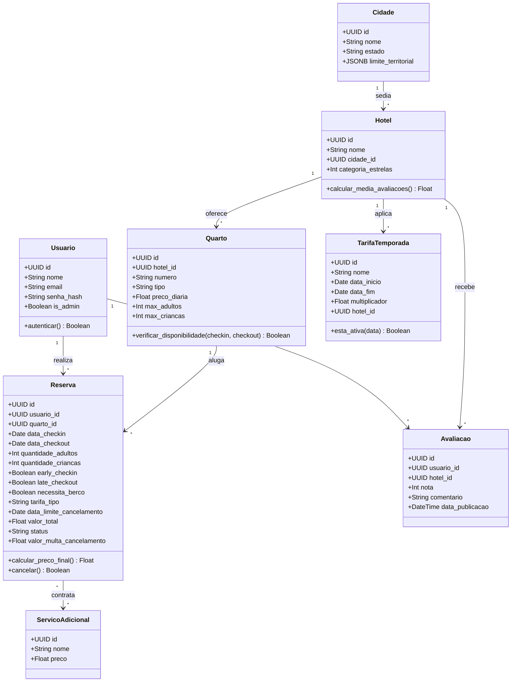
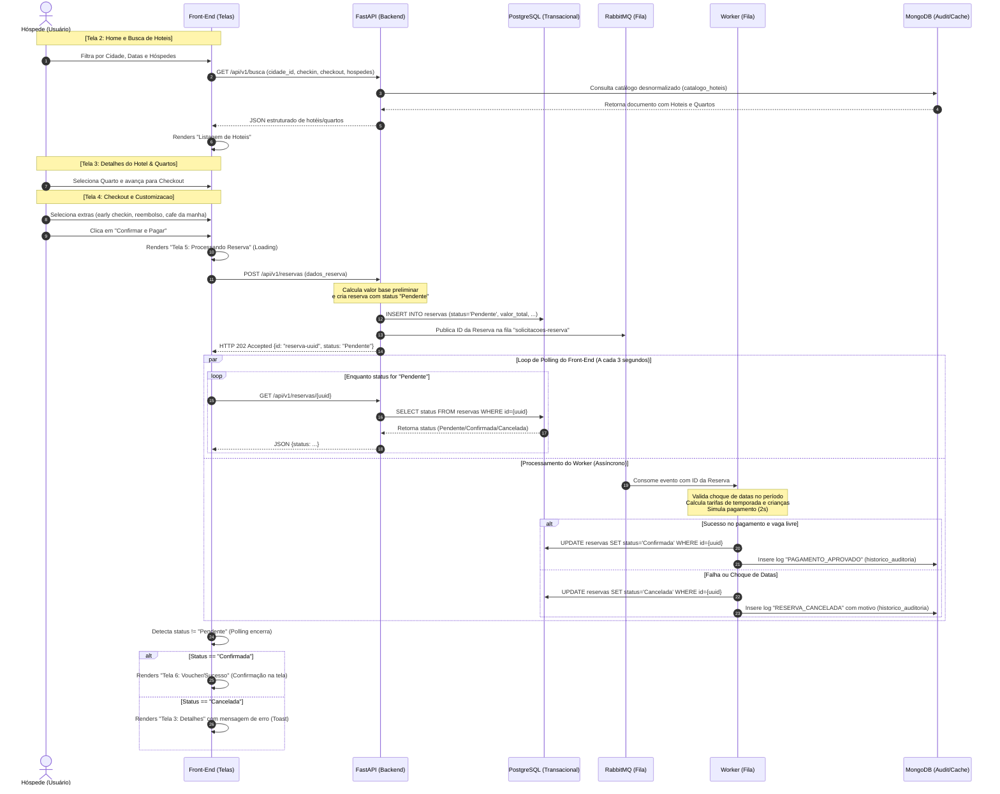

# Diagramas Técnicos do Projeto (Classes e Sequência)

Este documento apresenta os diagramas de **Classes** e de **Sequência** do sistema de reservas, servindo de guia para o desenvolvimento do banco de dados (SQLAlchemy), lógica do backend (FastAPI) e comportamento das interfaces (Front-End).

---

## 1. Diagrama de Classes (Domínio / SQLAlchemy)

Este diagrama representa a estrutura de classes de modelo (entities) que mapeiam o banco de dados PostgreSQL via ORM, destacando seus atributos principais, relacionamentos e métodos de lógica de negócio:

---

## 2. Diagrama de Sequência (Ciclo de Vida da Reserva e Telas)

Este diagrama detalha a linha do tempo e a troca de mensagens desde a busca de hotéis pelo cliente até a confirmação assíncrona da reserva, mostrando a relação entre as **telas (front-end)**, **API (FastAPI)**, **filas (RabbitMQ)**, **workers** e as **persistências (SQL e NoSQL)**:

