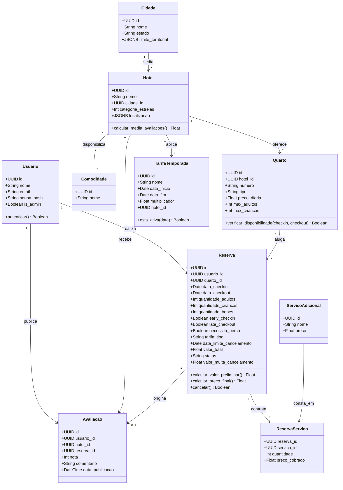
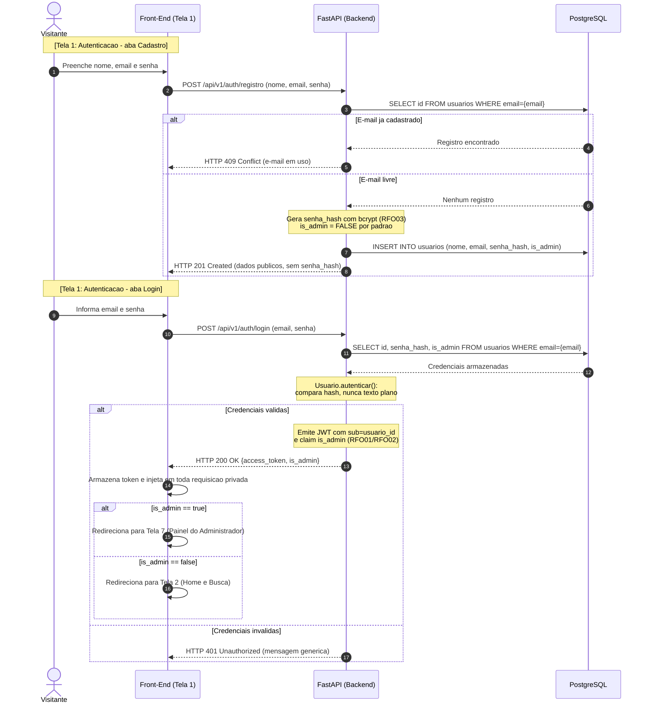
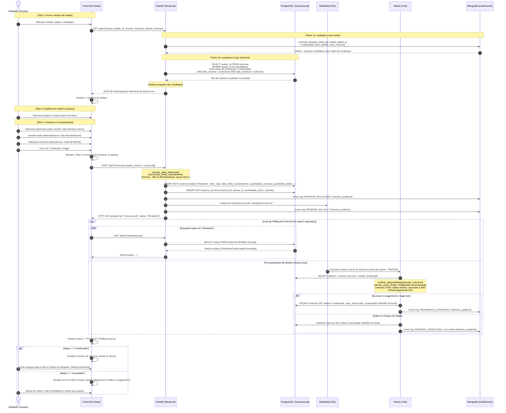
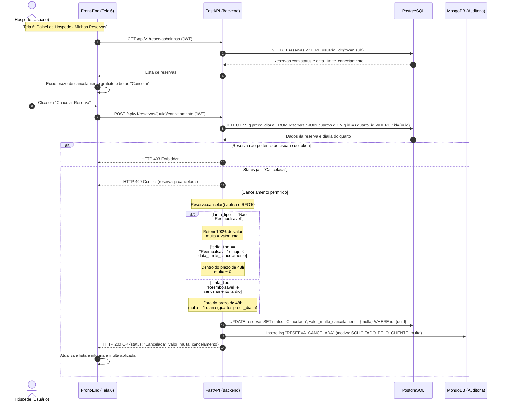
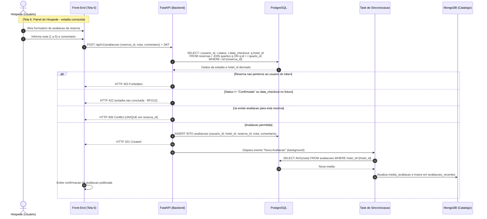

# Diagramas Técnicos do Projeto (Classes e Sequência)

Este documento apresenta o diagrama de **Classes** e os diagramas de **Sequência** do sistema de reservas, servindo de guia para o desenvolvimento do banco de dados (SQLAlchemy), lógica do backend (FastAPI) e comportamento das interfaces (Front-End).

Cada diagrama de sequência cobre um caso de uso dos [requisitos e casos de uso](../02_engenharia_software/requisitos_casos_uso.md):

| Seção | Diagrama | Casos de Uso |
| :--- | :--- | :--- |
| 1 | Classes de domínio (ORM) | — |
| 2 | Autenticação e Cadastro | UC01 |
| 3 | Busca e Solicitação de Reserva | UC02, UC03, UC04, UC12, UC13, UC14 |
| 4 | Cancelamento de Reserva | UC05 |
| 5 | Avaliação da Estadia | UC06 |
| 6 | Sincronização do Catálogo (CQRS) | UC07, UC08, UC09, UC15, UC16 |

---

## 1. Diagrama de Classes (Domínio / SQLAlchemy)

Este diagrama representa a estrutura de classes de modelo (entities) que mapeiam o banco de dados PostgreSQL via ORM, destacando seus atributos principais, relacionamentos e métodos de lógica de negócio:

```mermaid
classDiagram
    class Usuario {
        +UUID id
        +String nome
        +String email
        +String senha_hash
        +Boolean is_admin
        +autenticar() Boolean
    }

    class Cidade {
        +UUID id
        +String nome
        +String estado
        +JSONB limite_territorial
    }

    class Hotel {
        +UUID id
        +String nome
        +UUID cidade_id
        +Int categoria_estrelas
        +JSONB localizacao
        +calcular_media_avaliacoes() Float
    }

    class Comodidade {
        +UUID id
        +String nome
    }

    class Quarto {
        +UUID id
        +UUID hotel_id
        +String numero
        +String tipo
        +Float preco_diaria
        +Int max_adultos
        +Int max_criancas
        +verificar_disponibilidade(checkin, checkout) Boolean
    }

    class TarifaTemporada {
        +UUID id
        +String nome
        +Date data_inicio
        +Date data_fim
        +Float multiplicador
        +UUID hotel_id
        +esta_ativa(data) Boolean
    }

    class Reserva {
        +UUID id
        +UUID usuario_id
        +UUID quarto_id
        +Date data_checkin
        +Date data_checkout
        +Int quantidade_adultos
        +Int quantidade_criancas
        +Int quantidade_bebes
        +Boolean early_checkin
        +Boolean late_checkout
        +Boolean necessita_berco
        +String tarifa_tipo
        +Date data_limite_cancelamento
        +Float valor_total
        +String status
        +Float valor_multa_cancelamento
        +calcular_valor_preliminar() Float
        +calcular_preco_final() Float
        +cancelar() Boolean
    }

    class Avaliacao {
        +UUID id
        +UUID usuario_id
        +UUID hotel_id
        +UUID reserva_id
        +Int nota
        +String comentario
        +DateTime data_publicacao
    }

    class ServicoAdicional {
        +UUID id
        +String nome
        +Float preco
    }

    class ReservaServico {
        +UUID reserva_id
        +UUID servico_id
        +Int quantidade
        +Float preco_cobrado
    }

    %% Relacionamentos e Multiplicidades
    Cidade "1" --> "*" Hotel : sedia
    Hotel "1" --> "*" Quarto : oferece
    Hotel "1" --> "*" TarifaTemporada : aplica
    Hotel "*" -- "*" Comodidade : disponibiliza
    Usuario "1" --> "*" Reserva : realiza
    Quarto "1" --> "*" Reserva : aluga
    Usuario "1" --> "*" Avaliacao : publica
    Hotel "1" --> "*" Avaliacao : recebe
    Reserva "1" --> "0..1" Avaliacao : origina
    Reserva "1" --> "*" ReservaServico : contrata
    ServicoAdicional "1" --> "*" ReservaServico : consta_em
```

> **Nota sobre `ReservaServico`:** a associação Reserva ↔ ServicoAdicional é N:M, mas carrega atributos próprios (`quantidade` e `preco_cobrado`, que congela o preço praticado na data da reserva). Por isso é modelada como **classe associativa** — e não como uma associação simples —, mapeando diretamente a tabela `reserva_servicos`. A associação Hotel ↔ Comodidade, por não ter atributos, permanece como N:M puro.
>
> **Nota sobre o cálculo de preço:** `calcular_valor_preliminar()` é executado pela API no momento do `POST /reservas` (apenas diárias base, opcionais e serviços), enquanto `calcular_preco_final()` é executado pelo Worker, que aplica o multiplicador de `TarifaTemporada` e a tarifação por faixa de idade (RFO07/RFO08) e persiste o `valor_total` definitivo.

---

## 2. Diagrama de Sequência — Autenticação e Cadastro (UC01)

Cobre o cadastro de novos clientes e o login, incluindo o hashing de senha (RFO03), a emissão do token JWT (RFO01) e a bifurcação de destino conforme o perfil (RFO02):

```mermaid
sequenceDiagram
    autonumber
    actor Cliente as Visitante
    participant Front as Front-End (Tela 1)
    participant API as FastAPI (Backend)
    participant SQL as PostgreSQL

    %% Cadastro
    Note over Cliente, Front: [Tela 1: Autenticacao - aba Cadastro]
    Cliente->>Front: Preenche nome, email e senha
    Front->>API: POST /api/v1/auth/registro (nome, email, senha)
    API->>SQL: SELECT id FROM usuarios WHERE email={email}
    
    alt E-mail ja cadastrado
        SQL-->>API: Registro encontrado
        API-->>Front: HTTP 409 Conflict (e-mail em uso)
    else E-mail livre
        SQL-->>API: Nenhum registro
        Note over API: Gera senha_hash com bcrypt (RFO03)<br/>is_admin = FALSE por padrao
        API->>SQL: INSERT INTO usuarios (nome, email, senha_hash, is_admin)
        API-->>Front: HTTP 201 Created (dados publicos, sem senha_hash)
    end

    %% Login
    Note over Cliente, Front: [Tela 1: Autenticacao - aba Login]
    Cliente->>Front: Informa email e senha
    Front->>API: POST /api/v1/auth/login (email, senha)
    API->>SQL: SELECT id, senha_hash, is_admin FROM usuarios WHERE email={email}
    SQL-->>API: Credenciais armazenadas
    Note over API: Usuario.autenticar():<br/>compara hash, nunca texto plano
    
    alt Credenciais validas
        Note over API: Emite JWT com sub=usuario_id<br/>e claim is_admin (RFO01/RFO02)
        API-->>Front: HTTP 200 OK {access_token, is_admin}
        Front->>Front: Armazena token e injeta em toda requisicao privada
        
        alt is_admin == true
            Front->>Front: Redireciona para Tela 7 (Painel do Administrador)
        else is_admin == false
            Front->>Front: Redireciona para Tela 2 (Home e Busca)
        end
    else Credenciais invalidas
        API-->>Front: HTTP 401 Unauthorized (mensagem generica)
    end
```

> **Nota de segurança:** a resposta de erro do login deve ser genérica ("e-mail ou senha inválidos"), sem revelar se o e-mail existe — o `409` do cadastro já é o único ponto onde a existência do e-mail é exposta, por necessidade funcional. O `senha_hash` nunca aparece em nenhum schema de resposta (RFO03).
>
> Todas as rotas privadas dos diagramas seguintes assumem o header `Authorization: Bearer <token>` emitido aqui. As rotas de administração validam adicionalmente o claim `is_admin` (RFO02).

---

## 3. Diagrama de Sequência — Busca e Solicitação de Reserva (UC02, UC03, UC04)

Este diagrama detalha a linha do tempo e a troca de mensagens desde a busca de hotéis pelo cliente até a confirmação assíncrona da reserva, mostrando a relação entre as **telas (front-end)**, **API (FastAPI)**, **filas (RabbitMQ)**, **workers** e as **persistências (SQL e NoSQL)**:

```mermaid
sequenceDiagram
    autonumber
    actor Cliente as Hóspede (Usuário)
    participant Front as Front-End (Telas)
    participant API as FastAPI (Backend)
    participant SQL as PostgreSQL (Transacional)
    participant Fila as RabbitMQ (Fila)
    participant Worker as Worker (Fila)
    participant NoSQL as MongoDB (Audit/Cache)

    %% Passo 1: Busca (leitura em dois passos - ver nota abaixo)
    Note over Cliente, Front: [Tela 2: Home e Busca de Hoteis]
    Cliente->>Front: Filtra por Cidade, Datas e Hóspedes
    Front->>API: GET /api/v1/busca (cidade_id, checkin, checkout, adultos, criancas)
    
    Note over API, NoSQL: Passo 1a: catalogo (o que existe)
    API->>NoSQL: Consulta catalogo_hoteis por cidade.cidade_id<br/>e capacidade (max_adultos, max_criancas)
    NoSQL-->>API: Hoteis + Quartos candidatos (sem dado de ocupacao)
    
    Note over API, SQL: Passo 1b: ocupacao (o que esta livre)
    API->>SQL: SELECT quarto_id FROM reservas<br/>WHERE quarto_id IN (candidatos)<br/>AND status IN ('Pendente','Confirmada')<br/>AND data_checkin < {checkout} AND data_checkout > {checkin}
    SQL-->>API: IDs dos quartos ocupados no periodo
    
    Note over API: Subtrai ocupados dos candidatos
    API-->>Front: JSON de hotéis/quartos efetivamente disponíveis
    Front->>Front: Renders "Listagem de Hoteis"
    
    %% Passo 2: Seleção e Checkout
    Note over Cliente, Front: [Tela 3: Detalhes do Hotel & Quartos]
    Cliente->>Front: Seleciona Quarto e avança para Checkout
    Note over Cliente, Front: [Tela 4: Checkout e Customizacao]
    Cliente->>Front: Seleciona opcionais (early checkin, late checkout, berco)
    Cliente->>Front: Escolhe tarifa (Reembolsavel / Nao Reembolsavel)
    Cliente->>Front: Seleciona servicos adicionais (ex: Cafe da Manha)
    
    %% Passo 3: Criação de Reserva
    Cliente->>Front: Clica em "Confirmar e Pagar"
    Front->>Front: Renders "Tela 5: Processando Reserva" (Loading)
    Front->>API: POST /api/v1/reservas (dados_reserva + servicos[])
    
    Note over API: calcular_valor_preliminar()<br/>Deriva data_limite_cancelamento<br/>(checkin - 48h se Reembolsavel, senao NULL)
    API->>SQL: INSERT INTO reservas (status='Pendente', valor_total, data_limite_cancelamento, quantidade_criancas, quantidade_bebes, ...)
    API->>SQL: INSERT INTO reserva_servicos (reserva_id, servico_id, quantidade, preco_cobrado)
    API->>NoSQL: Insere log "RESERVA_SOLICITADA" (historico_auditoria)
    API->>Fila: Publica ID da Reserva na fila "solicitacoes-reserva"
    API->>NoSQL: Insere log "RESERVA_EM_FILA" (historico_auditoria)
    API-->>Front: HTTP 202 Accepted {id: "reserva-uuid", status: "Pendente"}
    
    %% Passo 4: Polling e Background Processing (Paralelos)
    par Loop de Polling do Front-End (A cada 3 segundos)
        loop Enquanto status for "Pendente"
            Front->>API: GET /api/v1/reservas/{uuid}
            API->>SQL: SELECT status FROM reservas WHERE id={uuid}
            SQL-->>API: Retorna status (Pendente/Confirmada/Cancelada)
            API-->>Front: JSON {status: ...}
        end
    and Processamento do Worker (Assíncrono)
        Fila->>Worker: Consome evento com ID da Reserva (serial por quarto - RNFO03)
        Worker->>SQL: SELECT reserva + reserva_servicos + tarifas_temporada
        Note over Worker: verificar_disponibilidade(checkin, checkout)<br/>calcular_preco_final(): multiplicador de temporada,<br/>criancas a 50%, bebes isentos, opcionais a 30%<br/>Simula pagamento (2s)
        
        alt Sucesso no pagamento e vaga livre
            Worker->>SQL: UPDATE reservas SET status='Confirmada', valor_total={valor_recalculado} WHERE id={uuid}
            Worker->>NoSQL: Insere log "PAGAMENTO_APROVADO" (historico_auditoria)
        else Falha ou Choque de Datas
            Worker->>SQL: UPDATE reservas SET status='Cancelada' WHERE id={uuid}
            Worker->>NoSQL: Insere log "RESERVA_CANCELADA" com motivo (historico_auditoria)
        end
    end

    %% Passo 5: Fim do Polling
    Front->>Front: Detecta status != "Pendente" (Polling encerra)
    
    alt Status == "Confirmada"
        Front->>Front: Renders Voucher de Sucesso (ainda na Tela 5)
        Cliente->>Front: Pode navegar para a Tela 6 (Painel do Hospede / Minhas Reservas)
    else Status == "Cancelada"
        Front->>Front: Renders erro na Tela 5 (Toast: quarto indisponivel ou falha no pagamento)
        Cliente->>Front: Opcao de voltar a Tela 3 (Detalhes) e tentar outro quarto
    end
```

> **Por que a busca tem dois passos (1a + 1b):** o documento `catalogo_hoteis` do MongoDB descreve **o que existe** (hotéis, quartos, preços, comodidades, média de avaliações), mas não guarda ocupação — reservas vivem apenas no PostgreSQL. Por isso o filtro de cidade e capacidade é resolvido no Mongo (satisfazendo o RFO04, que exige que a listagem venha do catálogo desnormalizado) e a exclusão dos quartos já ocupados no período é resolvida por uma única consulta ao Postgres, restrita aos IDs candidatos. Sem o passo 1b, os parâmetros `checkin`/`checkout` da busca seriam decorativos e a Tela 2 exibiria quartos indisponíveis.
>
> A condição `data_checkin < checkout AND data_checkout > checkin` é o teste padrão de **sobreposição de intervalos** — a mesma regra que o Worker aplica em `verificar_disponibilidade()` no UC12. Reservas `Pendente` entram no filtro para evitar que dois clientes disputem o mesmo quarto enquanto a fila processa; a garantia definitiva contra overbooking continua sendo a validação serial do Worker (RNFO03), pois esta busca é apenas uma leitura otimista.

---

## 4. Diagrama de Sequência — Cancelamento de Reserva (UC05)

Materializa as políticas de cancelamento do RFO10, que é onde vive o cálculo de multa. O método `Reserva.cancelar()` do diagrama de classes corresponde ao bloco de decisão abaixo:

```mermaid
sequenceDiagram
    autonumber
    actor Cliente as Hóspede (Usuário)
    participant Front as Front-End (Tela 6)
    participant API as FastAPI (Backend)
    participant SQL as PostgreSQL
    participant NoSQL as MongoDB (Auditoria)

    Note over Cliente, Front: [Tela 6: Painel do Hospede - Minhas Reservas]
    Front->>API: GET /api/v1/reservas/minhas (JWT)
    API->>SQL: SELECT reservas WHERE usuario_id={token.sub}
    SQL-->>API: Reservas com status e data_limite_cancelamento
    API-->>Front: Lista de reservas
    Front->>Front: Exibe prazo de cancelamento gratuito e botao "Cancelar"
    
    Cliente->>Front: Clica em "Cancelar Reserva"
    Front->>API: POST /api/v1/reservas/{uuid}/cancelamento (JWT)
    API->>SQL: SELECT r.*, q.preco_diaria FROM reservas r JOIN quartos q ON q.id = r.quarto_id WHERE r.id={uuid}
    SQL-->>API: Dados da reserva e diaria do quarto
    
    alt Reserva nao pertence ao usuario do token
        API-->>Front: HTTP 403 Forbidden
    else Status ja e "Cancelada"
        API-->>Front: HTTP 409 Conflict (reserva ja cancelada)
    else Cancelamento permitido
        Note over API: Reserva.cancelar() aplica o RFO10
        
        alt tarifa_tipo == "Nao Reembolsavel"
            Note over API: Retem 100% do valor<br/>multa = valor_total
        else tarifa_tipo == "Reembolsavel" e hoje <= data_limite_cancelamento
            Note over API: Dentro do prazo de 48h<br/>multa = 0
        else tarifa_tipo == "Reembolsavel" e cancelamento tardio
            Note over API: Fora do prazo de 48h<br/>multa = 1 diaria (quartos.preco_diaria)
        end
        
        API->>SQL: UPDATE reservas SET status='Cancelada', valor_multa_cancelamento={multa} WHERE id={uuid}
        API->>NoSQL: Insere log "RESERVA_CANCELADA" (motivo: SOLICITADO_PELO_CLIENTE, multa)
        API-->>Front: HTTP 200 OK {status: "Cancelada", valor_multa_cancelamento}
        Front->>Front: Atualiza a lista e informa a multa aplicada
    end
```

> **Onde cada coluna é preenchida:** `data_limite_cancelamento` é derivada pela API na criação da reserva (seção 3), enquanto `valor_multa_cancelamento` só recebe valor aqui, no cancelamento efetivo — coerente com a descrição da coluna no [dicionário de dados](modelagem_dados_postgres.md). Uma reserva ainda `Pendente` também pode ser cancelada; nesse caso o Worker deve descartar a mensagem ao encontrar o status já `Cancelada`.
>
> **Fora do escopo deste diagrama:** o RFO10 também prevê multa por **No-Show** (hóspede que não comparece). Como não há ator humano disparando esse evento, ele exige uma rotina agendada que varra reservas `Confirmada` com `data_checkin` no passado — a definição desse mecanismo fica a critério da equipe.

---

## 5. Diagrama de Sequência — Avaliação da Estadia (UC06)

Detalha a validação do RFO12, que depende da FK `avaliacoes.reserva_id`, e o reflexo da nova nota no catálogo do MongoDB:

```mermaid
sequenceDiagram
    autonumber
    actor Cliente as Hóspede (Usuário)
    participant Front as Front-End (Tela 6)
    participant API as FastAPI (Backend)
    participant SQL as PostgreSQL
    participant Sync as Task de Sincronizacao
    participant NoSQL as MongoDB (Catalogo)

    Note over Cliente, Front: [Tela 6: Painel do Hospede - estadia concluida]
    Cliente->>Front: Abre formulario de avaliacao da reserva
    Cliente->>Front: Informa nota (1 a 5) e comentario
    Front->>API: POST /api/v1/avaliacoes (reserva_id, nota, comentario) + JWT
    
    API->>SQL: SELECT r.usuario_id, r.status, r.data_checkout, q.hotel_id<br/>FROM reservas r JOIN quartos q ON q.id = r.quarto_id<br/>WHERE r.id={reserva_id}
    SQL-->>API: Dados da estadia e hotel_id derivado
    
    alt Reserva nao pertence ao usuario do token
        API-->>Front: HTTP 403 Forbidden
    else Status != "Confirmada" ou data_checkout no futuro
        API-->>Front: HTTP 422 (estadia nao concluida - RFO12)
    else Ja existe avaliacao para esta reserva
        API-->>Front: HTTP 409 Conflict (UNIQUE em reserva_id)
    else Avaliacao permitida
        API->>SQL: INSERT INTO avaliacoes (usuario_id, hotel_id, reserva_id, nota, comentario)
        API-->>Front: HTTP 201 Created
        
        API->>Sync: Dispara evento "Nova Avaliacao" (background)
        Sync->>SQL: SELECT AVG(nota) FROM avaliacoes WHERE hotel_id={hotel_id}
        SQL-->>Sync: Nova media
        Sync->>NoSQL: Atualiza media_avaliacao e insere em avaliacoes_recentes
        
        Front->>Front: Exibe confirmacao da avaliacao publicada
    end
```

> **`hotel_id` é derivado, não informado pelo cliente:** a API o obtém via `reserva → quarto → hotel`. Isso impede que alguém avalie um hotel diferente daquele onde de fato se hospedou. A coluna permanece gravada em `avaliacoes` por desnormalização (consultar avaliações por hotel é a operação mais frequente), mas nunca deve vir do payload.
>
> O recálculo de `media_avaliacao` é exatamente o disparo **"Nova Avaliação"** previsto nas [políticas de sincronização](modelagem_dados_mongodb.md), e é o que alimenta `Hotel.calcular_media_avaliacoes()` do diagrama de classes: o Postgres é a fonte da verdade, o Mongo guarda o valor pré-calculado para leitura.

---

## 6. Diagrama de Sequência — Sincronização do Catálogo (CQRS)

Diagrama de sequência das escritas administrativas (UC07, UC08, UC09, UC15, UC16) e da reconstrução do documento no MongoDB. Complementa o fluxo macro descrito na [modelagem NoSQL](modelagem_dados_mongodb.md), adicionando a ordem das operações e o tratamento de falha:

```mermaid
sequenceDiagram
    autonumber
    actor Gestor as Gestor (Admin)
    participant Front as Front-End (Tela 7)
    participant API as FastAPI (Backend)
    participant SQL as PostgreSQL
    participant Sync as Task de Sincronizacao
    participant NoSQL as MongoDB (catalogo_hoteis)

    Note over Gestor, Front: [Tela 7: Painel do Administrador]
    Gestor->>Front: Cria ou edita Hotel / Quarto / Comodidade
    Front->>API: POST ou PUT /api/v1/admin/... + JWT
    
    Note over API: Valida claim is_admin (RFO02)
    alt Token sem is_admin
        API-->>Front: HTTP 403 Forbidden
    else Autorizado
        API->>SQL: INSERT ou UPDATE na tabela de origem
        SQL-->>API: COMMIT confirmado
        API-->>Front: HTTP 200/201 (resposta imediata)
        
        Note over API, Sync: Sincronizacao ocorre APOS o commit,<br/>em background: nunca bloqueia a resposta
        API->>Sync: Dispara evento de sincronizacao (hotel_id afetado)
        
        Sync->>SQL: SELECT hotel + quartos + comodidades + AVG(avaliacoes.nota)
        SQL-->>Sync: Dados completos do hotel
        Note over Sync: Monta o documento desnormalizado inteiro
        Sync->>NoSQL: replace_one({_id: hotel_id}, documento, upsert=True)
        
        alt Falha na escrita do MongoDB
            Note over Sync: O Postgres permanece correto;<br/>apenas o catalogo fica desatualizado
            Sync->>Sync: Registra falha e reagenda a reconstrucao
        end
    end
```

> **Por que reconstruir o documento inteiro (`replace_one` + `upsert`) em vez de aplicar patches:** a operação fica **idempotente**. Reexecutar a sincronização duas vezes produz o mesmo documento, o que torna a repetição em caso de falha segura e trivial — essencial porque o Postgres já commitou e não há transação distribuída entre os dois bancos.
>
> **Consistência eventual é aceita por design:** entre o commit no Postgres e a atualização no Mongo existe uma janela em que a busca da Tela 2 pode exibir dados ligeiramente antigos (ex.: preço de diária recém-alterado). Isso é tolerável porque o preço cobrado de fato é sempre recalculado pelo Worker a partir do Postgres (seção 3) — o catálogo serve para *descoberta*, nunca como base de cobrança.
