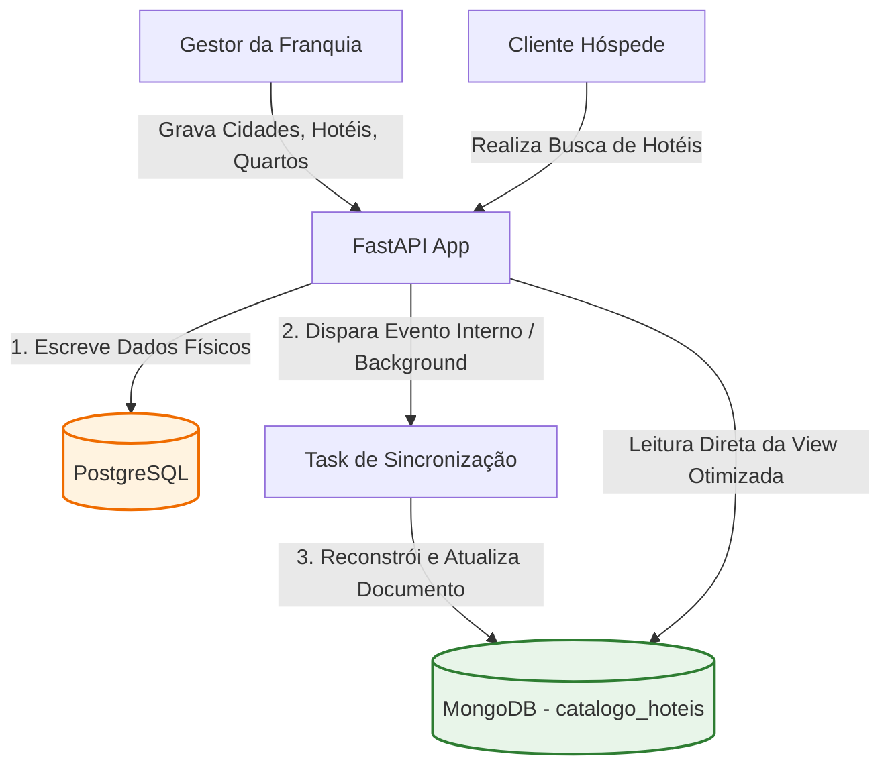
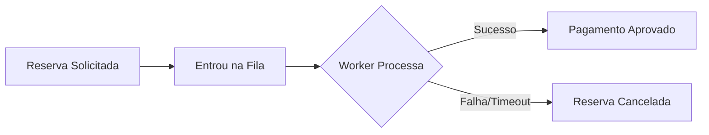

# Modelagem de Dados NoSQL (MongoDB)

Este documento define as diretrizes de arquitetura, o fluxo de sincronização, as políticas de disparos de eventos, os esquemas de documentos e as vantagens técnicas da utilização do **MongoDB** em conjunto com o PostgreSQL no **Sistema de Reservas de Rede Hoteleira**.

---

## 1. Por que usar MongoDB? (Vantagens)

Adotamos uma abordagem de **Persistência Poliglota**, utilizando cada banco de dados para a tarefa na qual ele é mais eficiente:

* **PostgreSQL (SQL Transacional):** Gerencia dados que necessitam de forte consistência ACÍDICA, controle transacional rigoroso e integridade referencial por chaves estrangeiras (ex: criação da Reserva, autenticação do Usuário e transações financeiras).
* **MongoDB (NoSQL de Documentos):** Gerencia dois casos de uso específicos:
  1. **Catálogo de Busca Otimizada (`catalogo_hoteis`):** Desnormaliza os dados de hotéis, quartos, comodidades e médias de avaliações em um único documento. Isso permite buscas ultrarápidas na tela principal do front-end com um único acesso à chave, eliminando `JOINs` custosos no Postgres sob alta carga.
  2. **Trilha de Auditoria Imutável (`historico_auditoria`):** Grava o histórico de eventos de ciclo de vida das reservas. A natureza flexível de documentos do MongoDB permite armazenar diferentes metadados para cada tipo de evento (ex: detalhes de erro de pagamento vs. detalhes de aplicação de cupom) sem engessar o esquema.
  3. **Indexação Geoespacial Nativa:** Facilita a busca de hotéis "próximos a mim" ou dentro de limites territoriais complexos de forma nativa através de índices do tipo `2dsphere`.

---

## 2. Fluxo de Dados e Sincronização (Mermaid)

Para manter o catálogo no MongoDB atualizado à medida que os dados originais (escritos no PostgreSQL) mudam, adotamos o padrão **CQRS (Command Query Responsibility Segregation)** orientado a eventos:



---

## 3. Políticas de Disparos (Eventos de Sincronização)

O catálogo no MongoDB (`catalogo_hoteis`) é uma **View Otimizada**. O backend deve atualizar ou reconstruir os documentos no MongoDB nos seguintes momentos (disparos):

| Ação de Origem (PostgreSQL) | Evento de Disparo | Ação no MongoDB |
| :--- | :--- | :--- |
| **Inserção/Edição de Hotel** | Criação ou atualização cadastral do hotel. | Cria ou atualiza as propriedades básicas do documento do hotel. |
| **Mudança em Quartos** | Criação, exclusão ou alteração de preço/tipo de um quarto. | Atualiza o array `quartos` dentro do documento do hotel correspondente. |
| **Associação de Comodidade** | Vínculo ou desvínculo de comodidades ao hotel. | Atualiza o array `comodidades` do hotel correspondente. |
| **Nova Avaliação** | Cliente posta nota e comentário sobre a estadia. | Recalcula a `media_avaliacao` e insere o item no array `avaliacoes_recentes` do hotel. |

---

## 4. Esquemas de Documentos (Modelos)

### 4.1. Coleção: `catalogo_hoteis`
Esta coleção armazena documentos desnormalizados e indexados de forma geoespacial (`2dsphere` na chave `cidade.coordenadas`).

```json
{
  "_id": "uuid-v7-hotel-01",
  "nome": "Vila dos Ventos Resort",
  "categoria_estrelas": 5,
  "cidade": {
    "cidade_id": "uuid-v7-cidade-99",
    "nome": "Quixadá",
    "estado": "CE",
    "coordenadas": {
      "type": "Point",
      "coordinates": [-39.015, -4.971]
    }
  },
  "comodidades": [
    "Piscina de Borda Infinita",
    "Wi-Fi de Alta Velocidade",
    "Academia 24h",
    "Estacionamento Gratuito"
  ],
  "quartos": [
    {
      "quarto_id": "uuid-v7-quarto-101",
      "numero": "101",
      "tipo": "Casal Luxo",
      "preco_diaria": 280.00,
      "max_adultos": 2,
      "max_criancas": 1
    },
    {
      "quarto_id": "uuid-v7-quarto-102",
      "numero": "102",
      "tipo": "Família Premium",
      "preco_diaria": 450.00,
      "max_adultos": 4,
      "max_criancas": 2
    }
  ],
  "media_avaliacao": 4.8,
  "avaliacoes_recentes": [
    {
      "usuario_nome": "Carlos Souza",
      "nota": 5,
      "comentario": "Instalações impecáveis e ótima internet para home office.",
      "data": {"$date": "2026-06-24T18:30:00Z"}
    },
    {
      "usuario_nome": "Ana Lima",
      "nota": 4,
      "comentario": "Muito bom, apenas a piscina estava um pouco fria.",
      "data": {"$date": "2026-06-18T10:15:00Z"}
    }
  ]
}
```

### 4.2. Coleção: `historico_auditoria`
Coleção de escrita contínua (Write-Heavy) que rastreia os eventos de processamento assíncrono de reservas.



#### Exemplo de Documento: Evento de Solicitação Inicial
```json
{
  "_id": {"$oid": "60b8d5a2f1d2a34b8c8d9e01"},
  "reserva_id": "uuid-v7-reserva-8888",
  "usuario_id": "uuid-v7-usuario-444",
  "evento": "RESERVA_SOLICITADA",
  "timestamp": {"$date": "2026-06-25T23:50:00Z"},
  "detalhes": {
    "quarto_id": "uuid-v7-quarto-101",
    "data_checkin": "2026-07-10",
    "data_checkout": "2026-07-15",
    "valor_total_estimado": 1400.00,
    "dispositivo": "Mobile App (Android)"
  }
}
```

#### Exemplo de Documento: Evento de Processamento de Pagamento (Sucesso)
```json
{
  "_id": {"$oid": "60b8d5a2f1d2a34b8c8d9e02"},
  "reserva_id": "uuid-v7-reserva-8888",
  "usuario_id": "uuid-v7-usuario-444",
  "evento": "PAGAMENTO_APROVADO",
  "timestamp": {"$date": "2026-06-25T23:52:15Z"},
  "detalhes": {
    "adquirente": "MercadoPago",
    "codigo_autorizacao": "auth_code_991823",
    "tentativas": 1,
    "tempo_resposta_ms": 1820
  }
}
```

#### Exemplo de Documento: Evento de Cancelamento Automático por Choque de Vagas
```json
{
  "_id": {"$oid": "60b8d5a2f1d2a34b8c8d9e03"},
  "reserva_id": "uuid-v7-reserva-9999",
  "usuario_id": "uuid-v7-usuario-555",
  "evento": "RESERVA_CANCELADA",
  "timestamp": {"$date": "2026-06-25T23:53:02Z"},
  "detalhes": {
    "motivo": "CHoque de datas de reservas concorrentes na fila do RabbitMQ",
    "quarto_id": "uuid-v7-quarto-101",
    "periodo_conflituoso": {
      "inicio": "2026-07-10",
      "fim": "2026-07-15"
    }
  }
}
```
