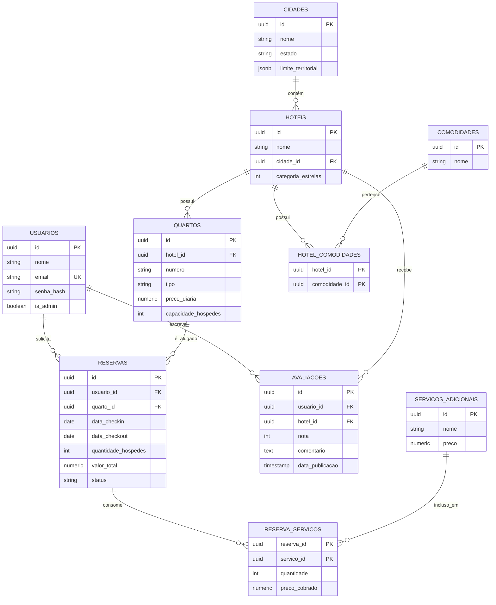

# Modelagem de Dados Relacional (PostgreSQL)

Este documento descreve o esquema de banco de dados relacional e a modelagem física para o **Sistema de Reservas de Rede Hoteleira** utilizando PostgreSQL. Toda a arquitetura utiliza identificadores únicos universais ordenados por tempo (**UUIDv7**) como chaves primárias.

---

## 1. Diagrama Entidade-Relacionamento (ERD)

Abaixo está a representação visual de todo o esquema expandido utilizando a sintaxe Mermaid:



---

## 2. Dicionário de Dados (Estrutura das Tabelas)

### Tabela: `usuarios`
Armazena as credenciais e o nível de acesso (se é cliente ou administrador da franquia).

| Nome da Coluna | Tipo SQL | Restrições | Descrição |
| :--- | :--- | :--- | :--- |
| `id` | `UUID` | `PRIMARY KEY` | Identificador único do usuário (UUIDv7). |
| `nome` | `VARCHAR(100)` | `NOT NULL` | Nome completo do usuário. |
| `email` | `VARCHAR(100)` | `UNIQUE`, `NOT NULL` | E-mail para login. |
| `senha_hash` | `VARCHAR(255)` | `NOT NULL` | Senha criptografada. |
| `is_admin` | `BOOLEAN` | `DEFAULT FALSE`, `NOT NULL` | Define privilégios de gestor (admin). |

### Tabela: `cidades`
Armazena a lista de cidades onde a franquia de hotéis opera.

| Nome da Coluna | Tipo SQL | Restrições | Descrição |
| :--- | :--- | :--- | :--- |
| `id` | `UUID` | `PRIMARY KEY` | Identificador único da cidade (UUIDv7). |
| `nome` | `VARCHAR(100)` | `NOT NULL` | Nome da cidade (ex: Quixadá). |
| `estado` | `CHAR(2)` | `NOT NULL` | Sigla da Unidade Federativa (ex: CE). |
| `limite_territorial` | `JSONB` | `NOT NULL` | Dados geográficos da cidade (polígono/fronteiras) representados em formato GeoJSON. |

### Tabela: `hoteis`
Armazena as informações das filiais da franquia.

| Nome da Coluna | Tipo SQL | Restrições | Descrição |
| :--- | :--- | :--- | :--- |
| `id` | `UUID` | `PRIMARY KEY` | Identificador único do hotel (UUIDv7). |
| `nome` | `VARCHAR(100)` | `NOT NULL` | Nome da filial do hotel. |
| `cidade_id` | `UUID` | `FOREIGN KEY REFERENCES cidades(id)` | Cidade na qual o hotel está localizado. |
| `categoria_estrelas` | `INTEGER` | `CHECK (categoria_estrelas BETWEEN 1 AND 5)` | Classificação do hotel (1 a 5 estrelas). |

### Tabela: `quartos`
Armazena as unidades habitacionais disponíveis para reserva em cada hotel.

| Nome da Coluna | Tipo SQL | Restrições | Descrição |
| :--- | :--- | :--- | :--- |
| `id` | `UUID` | `PRIMARY KEY` | Identificador único do quarto (UUIDv7). |
| `hotel_id` | `UUID` | `FOREIGN KEY REFERENCES hoteis(id)` | Hotel ao qual o quarto pertence. |
| `numero` | `VARCHAR(10)` | `NOT NULL` | Número ou identificador do quarto (ex: "101", "204-B"). |
| `tipo` | `VARCHAR(50)` | `NOT NULL` | Tipo do quarto (ex: "Standard", "Luxo", "Suíte Presidencial"). |
| `preco_diaria` | `NUMERIC(10, 2)` | `CHECK (preco_diaria >= 0)` | Preço cobrado por diária neste quarto específico. |
| `capacidade_hospedes`| `INTEGER` | `CHECK (capacidade_hospedes >= 1)` | Número máximo de pessoas permitidas no quarto. |

### Tabela: `comodidades`
Catálogo global de serviços/benefícios oferecidos pelos hotéis.

| Nome da Coluna | Tipo SQL | Restrições | Descrição |
| :--- | :--- | :--- | :--- |
| `id` | `UUID` | `PRIMARY KEY` | Identificador único da comodidade (UUIDv7). |
| `nome` | `VARCHAR(100)` | `UNIQUE`, `NOT NULL` | Nome da comodidade (ex: "Piscina", "Ar Condicionado"). |

### Tabela: `hotel_comodidades`
Tabela associativa Muitos-para-Muitos mapeando as comodidades disponíveis em cada hotel.

| Nome da Coluna | Tipo SQL | Restrições | Descrição |
| :--- | :--- | :--- | :--- |
| `hotel_id` | `UUID` | `PRIMARY KEY`, `FOREIGN KEY REFERENCES hoteis(id)` | Identificador do hotel. |
| `comodidade_id` | `UUID` | `PRIMARY KEY`, `FOREIGN KEY REFERENCES comodidades(id)` | Identificador da comodidade. |

### Tabela: `reservas`
Representa a transação de locação de um quarto por um período.

| Nome da Coluna | Tipo SQL | Restrições | Descrição |
| :--- | :--- | :--- | :--- |
| `id` | `UUID` | `PRIMARY KEY` | Identificador único da reserva (UUIDv7). |
| `usuario_id` | `UUID` | `FOREIGN KEY REFERENCES usuarios(id)` | Cliente que realizou a reserva. |
| `quarto_id` | `UUID` | `FOREIGN KEY REFERENCES quartos(id)` | Quarto locado. |
| `data_checkin` | `DATE` | `NOT NULL` | Data de início da hospedagem. |
| `data_checkout` | `DATE` | `NOT NULL`, `CHECK (data_checkout > data_checkin)` | Data de saída. |
| `quantidade_hospedes`| `INTEGER` | `CHECK (quantidade_hospedes >= 1)` | Número de pessoas presentes na hospedagem. |
| `valor_total` | `NUMERIC(10, 2)` | `NOT NULL` | Valor das diárias mais os serviços adicionais contratados. |
| `status` | `VARCHAR(20)` | `DEFAULT 'Pendente'`, `CHECK (status IN ('Pendente', 'Confirmada', 'Cancelada'))` | Estado atual do fluxo de reserva. |

### Tabela: `avaliacoes`
Registra a avaliação e o comentário do cliente após a experiência.

| Nome da Coluna | Tipo SQL | Restrições | Descrição |
| :--- | :--- | :--- | :--- |
| `id` | `UUID` | `PRIMARY KEY` | Identificador único da avaliação (UUIDv7). |
| `usuario_id` | `UUID` | `FOREIGN KEY REFERENCES usuarios(id)` | Autor da avaliação. |
| `hotel_id` | `UUID` | `FOREIGN KEY REFERENCES hoteis(id)` | Hotel avaliado. |
| `nota` | `INTEGER` | `CHECK (nota BETWEEN 1 AND 5)` | Nota de 1 a 5 estrelas dada pelo usuário. |
| `comentario` | `TEXT` | `NULL` | Feedback em texto. |
| `data_publicacao` | `TIMESTAMP` | `DEFAULT CURRENT_TIMESTAMP` | Data e hora em que a nota foi postada. |

### Tabela: `servicos_adicionais`
Catálogo de serviços extras que podem ser contratados para a estadia.

| Nome da Coluna | Tipo SQL | Restrições | Descrição |
| :--- | :--- | :--- | :--- |
| `id` | `UUID` | `PRIMARY KEY` | Identificador único do serviço (UUIDv7). |
| `nome` | `VARCHAR(100)` | `NOT NULL` | Nome do serviço (ex: "Translado", "Café da Manhã Premium"). |
| `preco` | `NUMERIC(10, 2)` | `CHECK (preco >= 0)` | Preço tabelado do serviço. |

### Tabela: `reserva_servicos`
Tabela associativa Muitos-para-Muitos mapeando os serviços adicionais vinculados a uma reserva específica.

| Nome da Coluna | Tipo SQL | Restrições | Descrição |
| :--- | :--- | :--- | :--- |
| `reserva_id` | `UUID` | `PRIMARY KEY`, `FOREIGN KEY REFERENCES reservas(id)` | Identificador da reserva. |
| `servico_id` | `UUID` | `PRIMARY KEY`, `FOREIGN KEY REFERENCES servicos_adicionais(id)` | Identificador do serviço contratado. |
| `quantidade` | `INTEGER` | `DEFAULT 1`, `CHECK (quantidade >= 1)` | Quantidade de itens/vezes contratados. |
| `preco_cobrado` | `NUMERIC(10, 2)` | `NOT NULL` | Histórico do valor cobrado na data da reserva. |

---

## 3. Comandos SQL DDL (Referência para Criação)

```sql
-- Usuários
CREATE TABLE usuarios (
    id UUID PRIMARY KEY,
    nome VARCHAR(100) NOT NULL,
    email VARCHAR(100) UNIQUE NOT NULL,
    senha_hash VARCHAR(255) NOT NULL,
    is_admin BOOLEAN DEFAULT FALSE NOT NULL
);

-- Cidades
CREATE TABLE cidades (
    id UUID PRIMARY KEY,
    nome VARCHAR(100) NOT NULL,
    estado CHAR(2) NOT NULL,
    limite_territorial JSONB NOT NULL
);

-- Hotéis
CREATE TABLE hoteis (
    id UUID PRIMARY KEY,
    nome VARCHAR(100) NOT NULL,
    cidade_id UUID NOT NULL REFERENCES cidades(id) ON DELETE CASCADE,
    categoria_estrelas INTEGER NOT NULL CHECK (categoria_estrelas BETWEEN 1 AND 5)
);

-- Quartos
CREATE TABLE quartos (
    id UUID PRIMARY KEY,
    hotel_id UUID NOT NULL REFERENCES hoteis(id) ON DELETE CASCADE,
    numero VARCHAR(10) NOT NULL,
    tipo VARCHAR(50) NOT NULL,
    preco_diaria NUMERIC(10, 2) NOT NULL CHECK (preco_diaria >= 0),
    capacidade_hospedes INTEGER NOT NULL CHECK (capacidade_hospedes >= 1)
);

-- Comodidades (Catálogo)
CREATE TABLE comodidades (
    id UUID PRIMARY KEY,
    nome VARCHAR(100) UNIQUE NOT NULL
);

-- Hotel_Comodidades (Associação N:M)
CREATE TABLE hotel_comodidades (
    hotel_id UUID NOT NULL REFERENCES hoteis(id) ON DELETE CASCADE,
    comodidade_id UUID NOT NULL REFERENCES comodidades(id) ON DELETE CASCADE,
    PRIMARY KEY (hotel_id, comodidade_id)
);

-- Reservas
CREATE TABLE reservas (
    id UUID PRIMARY KEY,
    usuario_id UUID NOT NULL REFERENCES usuarios(id) ON DELETE CASCADE,
    quarto_id UUID NOT NULL REFERENCES quartos(id) ON DELETE CASCADE,
    data_checkin DATE NOT NULL,
    data_checkout DATE NOT NULL,
    quantidade_hospedes INTEGER NOT NULL CHECK (quantidade_hospedes >= 1),
    valor_total NUMERIC(10, 2) NOT NULL CHECK (valor_total >= 0),
    status VARCHAR(20) DEFAULT 'Pendente' NOT NULL CHECK (status IN ('Pendente', 'Confirmada', 'Cancelada')),
    CONSTRAINT chk_data_checkout CHECK (data_checkout > data_checkin)
);

-- Avaliações
CREATE TABLE avaliacoes (
    id UUID PRIMARY KEY,
    usuario_id UUID NOT NULL REFERENCES usuarios(id) ON DELETE CASCADE,
    hotel_id UUID NOT NULL REFERENCES hoteis(id) ON DELETE CASCADE,
    nota INTEGER NOT NULL CHECK (nota BETWEEN 1 AND 5),
    comentario TEXT,
    data_publicacao TIMESTAMP DEFAULT CURRENT_TIMESTAMP NOT NULL
);

-- Serviços Adicionais (Catálogo)
CREATE TABLE servicos_adicionais (
    id UUID PRIMARY KEY,
    nome VARCHAR(100) NOT NULL,
    preco NUMERIC(10, 2) NOT NULL CHECK (preco >= 0)
);

-- Reserva_Serviços (Associação N:M)
CREATE TABLE reserva_servicos (
    reserva_id UUID NOT NULL REFERENCES reservas(id) ON DELETE CASCADE,
    servico_id UUID NOT NULL REFERENCES servicos_adicionais(id) ON DELETE CASCADE,
    quantidade INTEGER DEFAULT 1 NOT NULL CHECK (quantidade >= 1),
    preco_cobrado NUMERIC(10, 2) NOT NULL CHECK (preco_cobrado >= 0),
    PRIMARY KEY (reserva_id, servico_id)
);
```
